# Serial VGA Controller
A VGA controller built around an 8‑bit PIC18F47K42, capable of generating 16 colors at an impressive 360×480 resolution, while using minimal external components. It is controlled through a UART interface, accepts ANSI‑style escape sequences and supports multiple screen modes.

You can watch a short [Demo Video](https://www.youtube.com/watch?v=Uq0Z-Li6JEw) showcasing the controller in action.


## The VGA History
The VGA standard and its corresponding controller were developed by IBM in 1987 and within the following three years it dominated the market of IBM-compatible computers. It supported a resolution of 640x480 with 16 colors and used a 15-pin input interface.

The standard was largely based on the older and well-established NTSC analog television standard, retaining many technical characteristics in order to facilitate the creation of VGA-to-TV converters. It maintained the same vertical resolution of 525 horizontal lines, of which only 480 are visible, while it chose a horizontal scanning frequency of 31.469 kHz, exactly double that of the NTSC standard.

Its operating principle is based on the serial scanning of the screen, line by line (from left to right, from top to bottom). For proper synchronization with the display, two synchronization signals are generated, whose active portion is at a logical low level:

The horizontal synchronization pulse (HSYNC), which is activated at the beginning of each line, and
The vertical synchronization pulse (VSYNC), which is activated at the end of each frame to restart scanning from the top of the screen.
In addition, it produces three analog signals with levels ranging from 0 V up to 0.7 V, corresponding to the RGB (Red, Green, Blue) color channels.

## The digital signals anatomy
The VGA standard imposes strict specifications regarding the frequency and structure of the generated signal, which consists of two main components: the horizontal and vertical synchronization pulses.

Proper timing ensures the stable and reliable display of the image on the screen, synchronizing the rendering of each line (scanline) and each frame. All the individual time intervals are based on a unified clock frequency, known as the Pixel Clock. The Pixel Clock frequency is 25.175 MHz. Based on this frequency, both the horizontal and vertical refresh rates are calculated, which are critical for the correct refresh of the image on the screen.


<div align="center">

| Scanline Part | Cycles | Duration (μs) |
| :------------ | :----: | ------------: |
| Active Area   |  640   |         25.42 |
| Front Porch   |   16   |          0.64 |
| Sync Part     |   96   |          3.81 |
| Back Porch    |   48   |          1.91 |
| Scanline      |  800   |         31.78 |

<p><em>HSYNC timings</em></p>


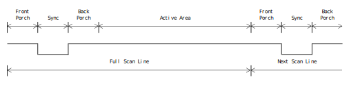


| Frame Part    | Lines Count | Duration (ms) |
| :------------ | :----------: | ------------: |
| Active Area   |     480      |        15.25  |
| Front Porch   |      10      |         0.32  |
| Sync Part     |       2      |         0.06  |
| Back Porch    |      33      |         1.05  |
| Full Frame    |     525      |        16.68  |

<p><em>VSYNC timings</em></p>


  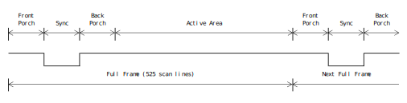
  <p><em>VSYNC signal</em></p>


&nbsp;

---


</div>

## **Analog RGB signals**

The transmission of color information is carried out through an analog RGB signal (Red, Green, Blue).  
The overall signal is separated into three independent channels, each carrying the information for one primary color:

- Red channel
- Green channel
- Blue channel

The signal level of each channel ranges from **0.00 V** to **0.70 V**, where:


<div align="center">

| Level (Volt) | Brightness                |
| :----------: | -------------------------- |
|    0.00      | Absence of Color (Black)  |
|    0.35      | Medium Brightness Color   |
|    0.70      | Maximum Brightness Color  |

<p><em>RGB Signal Levels</em></p>

</div>

This range is generated by a digital-to-analog converter (DAC), which converts the digital value of each color into the corresponding analog voltage level.  
It is evident that three DACs are required, one for each color channel.

The combined activation of the RGB channels leads to additive color synthesis, which enables the creation of a wide overall color spectrum.

<div align="center">
  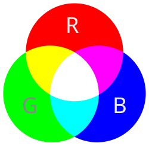
  <p><em>Additive Color Mix</em></p>
</div>

## **Hardware Architecture**

The VGA controller is implemented using a PIC 18F47K42 microcontroller, squeezing out every bit of its available
horsepower through efficient utilization of its peripherals.

The choice of an 8-bit microcontroller was not accidental. While employing a 32-bit ARM Cortex‑M device
or an FPGA would have made the implementation considerably easier, it would undermine the very
objective of the project. The aim was not to build a high‑performance VGA controller, but to prove that
even a resource‑limited microcontroller, when paired with smart peripheral management and disciplined
programming, can satisfy the strict requirements of the VGA standard and produce a continuous,
flicker‑free video signal.

To better illustrate the overall system design, the hardware architectural overview is presented in the diagram below:

<div align="center">
  
  <p><em>Hardware Architectural Overview</em></p>
</div>

As shown above, the system consists of three major independent functional units, which cooperate to generate all the signals required for driving the display.  
Specifically, the hardware includes two internal and one external entity. Those are:

- **Synchronization Signal Generation Unit (internal)**  
  Responsible for producing the horizontal and vertical synchronization signals.

- **Visible Area Signal Generation Unit (internal)**  
  Generates the intersection of the horizontal and vertical active areas and enables the multiplexers.

- **RGB Analog Signal Generation Unit (external)**  
  Implemented outside the microcontroller and includes the multiplexers and digital‑to‑analog converters that produce the analog RGB signal.


## **SYNC Signals Generation Unit**

The SYNC signals are generated exclusively in hardware using the MCU peripherals.  
As a result, the microcontroller, operating at 14.3182 MIPS, is able to maintain precise timing for horizontal and vertical synchronization without imposing additional software overhead.  
This hardware‑based generation ensures deterministic signal edges, minimizes jitter, and allows the CPU core to remain available for higher‑level tasks.

<div align="center">
  
  <p><em>SYNC signals generator</em></p>
</div>

Note that the clock used is not the standard 25.175 MHz.  
This frequency would be out of specification for the PIC18F47K42, whose maximum supported external clock input is 16 MHz.  
Instead, given the partial backward compatibility with the NTSC standard, a passive crystal of **14.3182 MHz** has been selected.  
This frequency is commonly used in televisions that support NTSC analog signals and is both widely available and extremely low cost.

The MCU is set to use **4× PLL** internally.  
However, due to the PIC18 architecture, the system clock is always divided by 4 to obtain the instruction clock: **$OSC / 4$**

With a **14.3182 MHz** external crystal and the PLL set to **4×**, the internal oscillator becomes: $14.3182\,\text{MHz} \times 4 = 57.2728\ \text{MHz}$

and the instruction clock becomes:
$57.2728\,\mathrm{MHz} / 4 = 14.3182\ \mathrm{MHz}$

Therefore, the instruction clock ends up **exactly equal** to the crystal frequency, and the **pixel clock** becomes effectively **14.3182 MHz**, matching the instruction rate.

By making this choice, the maximum pixel clock frequency corresponds to:

$14.3182\,\mathrm{MHz} / 25.175\ \mathrm{MHz} = 0.5687$ → **56.87%** of the standard

Thus, the cycles corresponding to each scanline become: $800 \times 0.5687 = 455$
 
This ensures perfect alignment with the timing requirements of the standard, since:
$455 / 14.3182\,\mathrm{MHz} = 31.78\ \mu s$

At the same time, this choice limits the maximum horizontal resolution:
$640 \times 0.5687 = 364$ pixels

Although this value appears significantly lower than the original 640 pixels, it is entirely acceptable for data visualization and far exceeds the typical resolutions achieved by 8‑bit era computers.

The following table shows the recalculated VGA horizontal timing parameters when the pixel clock is derived from a **14.3182 MHz** crystal.  
Each section has been proportionally adjusted to match the lower clock frequency, while the overall length remains **31.78 µs**, perfectly matching the VGA standard:

<div align="center">

| Section       | Cycles | Time (µs) |
| :------------ | :----: | --------: |
| Active Area   |  364   |     25.42 |
| Front Porch   |   9    |      0.63 |
| Sync Part     |   55   |      3.84 |
| Back Porch    |   27   |      1.89 |
| **Whole line**| **455**| **31.78** |

<p><em>Adjusted HSYNC signal</em></p>

</div>

---

## **Visible Area Signal Generation Unit**

The Visible Area Video signal is also hardware‑assisted, further reducing the processing load on the MCU.  
It utilizes two PWM modules to generate the required timing intervals:

- **PWM6** produces a signal with an active duration of **1.89 µs**, corresponding to the Horizontal Back Porch.
- **PWM7** produces a signal with an active duration of **27.31 µs**, equal to the sum of the Horizontal Active Video and Horizontal Back Porch.

The intersection of the **inverted PWM6** signal and the **PWM7** signal defines the Horizontal Active Video interval.  
The intersection of this interval with the corresponding interval of the vertical synchronization pulse defines the **Visible Video area**.

<div align="center">
  
  <p><em>Visible Area Signal Generator</em></p>
</div>

<div align="center">
  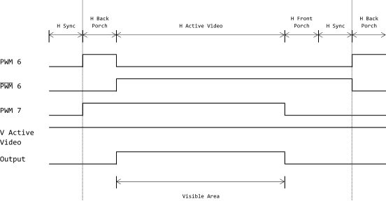
  <p><em>Visible Area Signal – PWM intersection</em></p>
</div>

The VSYNC, HSYNC, and Visible Area signals collectively define the complete VGA frame.  
Pixel data is transmitted to the VGA interface **only during the intersection** of the H Active Area and V Active Area.

<div align="center">
  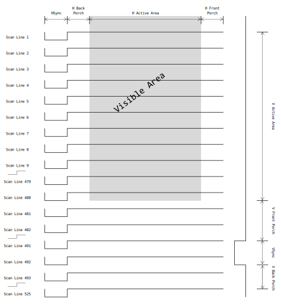
  <p><em>Full VGA Frame</em></p>
</div>

---

## **RGB Analog Signal Generation Unit**

The VGA controller relies on minimal external hardware, consisting only of two **2:1 multiplexers** and a simple **R‑2R resistor ladder**.  
These components, together with the microcontroller’s peripherals, form the complete signal path required to generate the VGA output without additional complex circuitry.

For each RGB color channel, two multiplexers are used:

- one for selecting **foreground/background** color  
- one for selecting **low/high brightness** intensity  

All brightness multiplexers are interconnected so that the intensity selection applies simultaneously to all three channels.

Although a single brightness multiplexer could theoretically drive all channels, practical considerations prevent this.  
The widely available 74HC257 / 74AHC257 multiplexers allow **12–35 mA** per pin, and their output voltage varies with load.  
To ensure stable DAC output and manufacturer‑independent behavior, **one multiplexer per color channel** is used.

<div align="center">
  
  <p><em>RGB color generator block diagram</em></p>
</div>

<div align="center">
  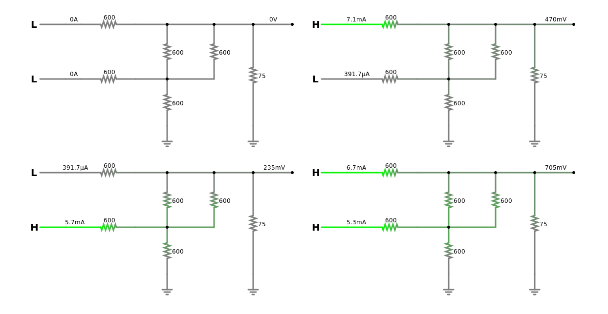
  <p><em>2‑Bit R‑2R DAC</em></p>
</div>

Note that the **75 Ω** resistor in the schematic is the monitor’s input termination, not part of the on‑board DAC.

The outputs of each pair of multiplexers feed the **2‑bit DAC** of the corresponding color channel.  
The color information, already quantized into 4 bits, is mapped to **16 discrete analog levels** in the range **0.0–0.7 V**, producing 16 colors.

<div align="center">
  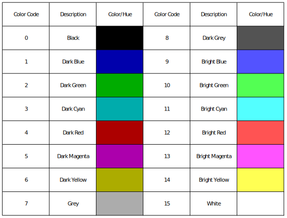
  <p><em>Color Chart</em></p>
</div>

## **Software Architecture**

The Software Architecture of the VGA controller is based on a layered model, which separates the low-level hardware management from the high-level application logic. This design approach enhances modularity, maintainability, and scalability of the codebase.

<div align="center">
  
  <p><em>Software Architecture</em></p>
</div>

The MCU operates at 14.3182 MIPS to maintain exact alignment with VGA timing requirements.  
Each video frame contains 525 total scanlines, of which 480 are visible.  
During the visible region the MCU is fully occupied generating pixel output, leaving only the remaining 45 non-visible lines, barely **8.6%** of the total frame time available for secondary tasks such as interpreting incoming commands and handling auxiliary system logic.  
This extremely limited processing window was a key constraint that shaped the software architecture of the system.

The time-critical video generation is performed entirely inside the ISR to ensure that VGA timing requirements are met with absolute precision.  
During the active vertical region, the ISR is triggered at the beginning of each scanline by the compare interrupt, which is the only active interrupt and is driven by a dedicated hardware timer.  
The ISR is carefully designed to complete its work within the strict timing constraints of the VGA signal.  
Each active scanline is generated in real time using a “racing the beam” approach, where pixel data is produced on-the-fly as the scanline progresses across the display.

Outside the active vertical region, the ISR is not invoked on each scanline.  
Instead, the compare interrupt is reconfigured to fire at the beginning of the front porch, the sync pulse, and the back porch intervals, ensuring that the VSYNC signal is asserted and cleared at the correct times.  
Additionally, during these non-active intervals, the ISR checks for any pending interrupt flags and sets the corresponding Reactor event flags, initiating the appropriate processing of asynchronous events.

The program's main loop, implemented by the Reactor module, orchestrates all non-time-critical activity in the system.  
It continuously evaluates a set of registered event sources such as buffer updates, DMA transfer notifications, command-processing triggers, UART error conditions, and external inputs such as button events.  
When an event is detected, it invokes the appropriate event handler.

When new data arrives through the UART interface, the DMA engine stores it into a circular buffer without consuming CPU time.  
The appropriate event flag is then raised, prompting the Reactor to hand the buffered data to the Interpreter module, which parses the command stream and executes the corresponding operation through the video terminal module.

The video terminal supports three video modes: **text mode**, **plot mode**, and **image mode**.  
It also provides a range of functions for manipulating the video buffer, including clearing the screen, setting the cursor position, changing colors, drawing lines and circles, painting pixels, and more.

The VGA controller has been extensively tested at several UART speeds and it can process incoming commands reliably without suffering any data loss.  
The sweet spot has been found to be **28800 baud**.  
At higher baud rates, the system is designed to signal back a wait message whenever the circular buffer approaches a critical fill level, indicating that it is temporarily unable to accept additional data at the current rate.  
This mechanism ensures that command processing remains stable and prevents buffer overruns even under heavy input load.

---

## **Interpreter**

Each command received through the UART communication bus is appropriately processed, checked for
syntactic correctness, and then the corresponding function is executed. Therefore, it was necessary
to design a rudimentary communication language together with an interpreter for that language.

Terminals of the past used a standardized set of control commands, known as
[ANSI Escape Codes](https://en.wikipedia.org/wiki/ANSI_escape_code).
This protocol remains in use today for configuring and controlling
character display in terminal emulators, as well as for interaction with systems based on serial communication.

Following this approach, a set of commands was designed based on a
[context-free grammar (CFG)](https://en.wikipedia.org/wiki/Context-free_grammar),
with the aim of clarity and strict formalization of syntactic rules.
The terminal and non-terminal symbols, along with the production rules of the language, were defined using the
[Backus–Naur Form (BNF)](https://en.wikipedia.org/wiki/Backus%E2%80%93Naur_form) notation:

```
<esc code> ::= <esc> <command> | <character>

<command>  ::= <alpha> <parameters seq> | <alpha>

<parameters seq> ::= <parameter> <parameter tail>

<parameters tail> ::= <parameter delimiter> <parameters seq> | <parameter end>

<parameter> ::= <digit> <parameter> | <digit>

<digit> ::= 0 | 1 | 2 | 3 | 4 | 5 | 6 | 7 | 8 | 9

<parameter delimiter> ::= ,

<parameter end> ::= 0x0d | ;

<esc> ::= 0x1b

<alpha> ::= a | b | c | d | e | f | g | h | i | j | k | l | m | n | o | p | q | r | s | t | u | v | w | x | y | z
           | A | B | C | D | E | F | G | H | I | J | K | L | M | N | O | P | Q | R | S | T | U | V | W | X | Y | Z

<character> ::= <digit> | <alpha>
  
```

From the above set of grammar rules, three groups of commands are formed, each corresponding
to one of the operating states of the VGA controller.

---

## **Text Mode Commands**

| Command | Description |
|--------|-------------|
| `<ESC>E;` | Clear Screen |
| `<ESC>O;` | Set Cursor ON |
| `<ESC>F;` | Set Cursor OFF |
| `<ESC>B;` | Blink ON |
| `<ESC>B;` | Blink OFF |
| `<ESC>y <x>,<y>;` | Set Cursor Position |
| `<ESC>b <color>;` | Set Background Color |
| `<ESC>f <color>;` | Set Foreground Color |
| `<ESC>m <mode>;` | Change Video Mode |
| `<ESC>d <x1>,<y1>,<x2>,<y2>,<1>;` | Draw Thin Rectangle |
| `<ESC>d <x1>,<y1>,<x2>,<y2>,<2>;` | Draw Thick Rectangle |
| `<ESC>d <x1>,<y1>,<x2>,<y2>,<10>;` | Draw Thin Window |
| `<ESC>d <x1>,<y1>,<x2>,<y2>,<20>;` | Draw Thick Window |

<p align="center"><em>Text Mode Commands</em></p>

---

## **Plot Mode Commands**

| Command | Description |
|--------|-------------|
| `<ESC>E;` | Clear Screen |
| `<ESC>b <color>;` | Set Background Color |
| `<ESC>f <color>;` | Set Foreground Color |
| `<ESC>p <f>,<b>;` | Set Both Colors |
| `<ESC>l <x1>,<y1>,<x2>,<y2>,<color>;` | Draw Line |
| `<ESC>c <x>,<y>,<radius>,<color>;` | Draw Circle |
| `<ESC>s <x>,<y>,<color>;` | Set Pixel |
| `<ESC>m <mode>;` | Change Video Mode |

<p align="center"><em>Plot Mode Commands</em></p>

---

## **Image Mode Commands**

| Command | Description |
|--------|-------------|
| `<ESC>p <f>,<b>,<x>,<y>;` | Set fore/back ground color for image cell at {x,y} |
| `<ESC>p <f>,<b>;` | Paint Picture |
| `<ESC>l <picture>;` | Load Picture |
| `<ESC>m <mode>;` | Change Video Mode |

<p align="center"><em>Image Mode Commands</em></p>

---

For the interpretation of commands, it was necessary to construct a **Finite State Machine (FSM)**,
which forms the core of the command interpreter. Symbols received from the UART bus are checked
against the grammar of the command language, making the FSM a real-time syntactic parser that
transitions between predefined states based on each symbol received.

The method chosen for implementing the FSM is based on the
[State Pattern](https://en.wikipedia.org/wiki/State_pattern), a design pattern that allows an object to change its behavior
depending on the current state of the system. This approach was selected because it offers
significant advantages compared to the traditional construction of FSMs using multiple nested
conditional statements, particularly in terms of time complexity. It also provides
excellent maintainability and future extensibility, with the only real cost being the
additional design and development time.

---

## **Video Terminal**

The Video Terminal module is designed to support multiple operating modes, each defined by their
resolution, color depth, and pixel dimensions. Notably, the *Image Mode* emulates the display
characteristics of the classic ZX Spectrum, while extending the resolution to 360×480
with 16 colors at 4‑bit depth. The following table summarizes the available display
modes and their key characteristics.

## **Supported Video Modes**

<div align="center">

| Code | Description | Resolution | Colors | Color depth | Cell size |
|------|-------------|------------|--------|-------------|-----------|
| 0 | Text mode  | 360×480 | 16 | 4‑bit | 8×12 |
| 1 | Image mode | 360×480 | 16 | 4‑bit | 8×8 |
| 2 | Plot mode  | 360×120 | 16 | 1‑bit | 1×1 |

<p align="center"><em>Video Modes</em></p>
</div>

## **Text Mode**

In text mode, the video buffer is organized into **40 rows × 45 columns**.  
Each element of the buffer corresponds to a display position and consists of **16‑bit data**.  
The first byte specifies the ASCII character to be displayed, while the second byte defines its
color attributes, as illustrated in the following table:

<div align="center">

| Byte 0 (bits 7‑0) | Byte 1: Background (bits 7‑4) | Byte 1: Foreground (bits 3‑0) |
|-------------------|-------------------------------|-------------------------------|
| ASCII Code        | Background Color              | Foreground Color              |

<p><em>Organization of the Video Buffer in Text Mode</em></p>
</div>

Each character corresponds to a graphical symbol (glyph) with dimensions of **12 × 8 pixels**.  
The following figure shows an indicative rendering of the character “A”:

<p align="center">
  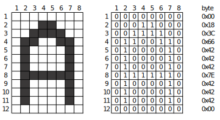
  <br>
  <em>Glyph Representation</em>
</p>

It is evident that in order to cover the entire range of the ASCII table,  
$12 \times 256 = 3072$ bytes are required.  
The storage of the symbol table is not done in RAM but in **FLASH memory**.  
This choice was both strategic and technically necessary, since the controller’s RAM is limited  
and therefore reserved strictly for dynamic data.

<p align="center">
  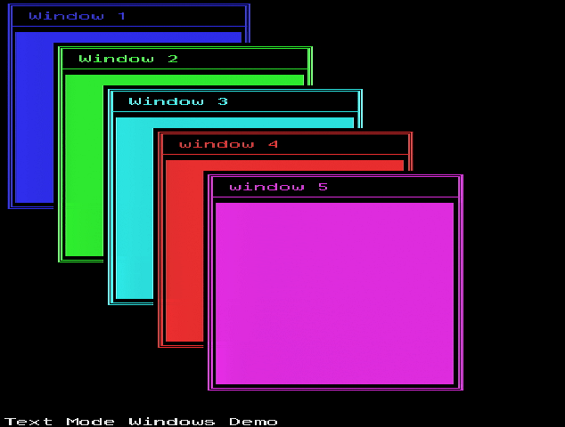
  <br>
  <em>Text mode demo</em>
</p>

## **Image Mode**

The image mode allows the display of images at **360 × 480 pixels** and supports **16 colors**.  
Each image of this size requires:

$480 \times 360 \times 4 \text{ bits} = 86{,}400 \text{ bytes}$

Storing even a single image in the microcontroller’s FLASH memory would occupy almost **70%** of its total capacity.  
Therefore, a different approach was necessary.

The chosen solution keeps the display resolution unchanged while applying compression to the color data, thereby reducing both the memory requirements and the timing complexity for preparing and transmitting data to the VGA port.

Two tables are used, with dimensions **480 × 45 bytes** and **45 × 60 bytes** respectively.  
The first stores the **1‑bit depth image data**, requiring:

$360 \times 480 \times 1 \text{ bit} = 21{,}600 \text{ bytes}$

The second stores the compressed color information, logically divided into **60 rows × 45 columns**.  
Each element is **8 bits**, where:

- upper 4 bits → background color  
- lower 4 bits → foreground color  

Each logical **8 × 8 pixel** block in the image data table corresponds to one element of the color table.

Thus:

$45 \times 60 = 2{,}700 \text{ bytes}$

In total, **24.3 KB** are required to store a complete image.  
With this approach, memory usage drops to **less than 30%** of the original, making it possible to store **up to four images** in FLASH.

This compression technique was widely used by computers of the 1980s, including the **ZX Spectrum**.  
As a result, free applications existed that could convert images using this method, eliminating the need to develop additional image‑processing software.

Later tests showed that it was technically feasible to double the resolution of the color information to **4 × 4 cells** instead of **8 × 8**, but no free conversion software was available.  
Since developing such software would require significant time, the original approach was retained.

To illustrate the compression process, the following example shows the result of converting a 16‑color image with 4‑bit depth per pixel into a 16‑color image with 4‑bit depth per **8 × 8** cell.

<p align="center">
  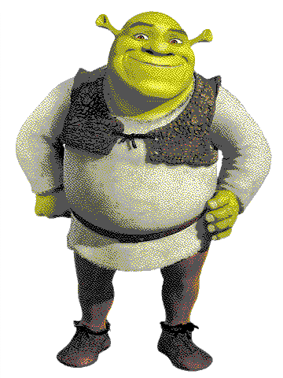
  <br>
  <em>Original 16‑color picture</em>
</p>

<p align="center">
  
  <br>
  <em>Compressed 16‑color picture</em>
</p>

<p align="center">
  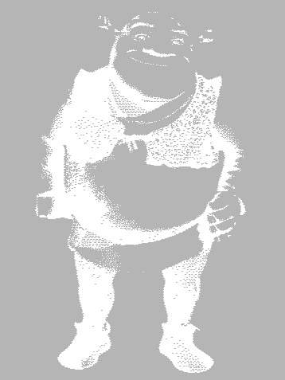
  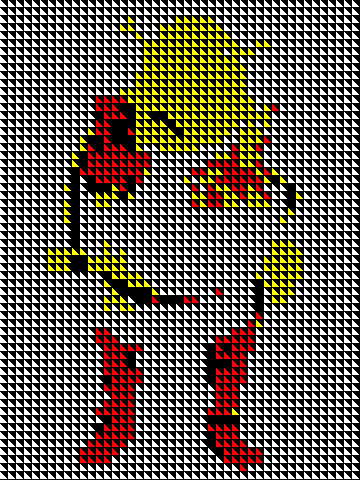
  <br>
  <em>Image Data with 1‑bit Depth&nbsp;&nbsp;&nbsp;&nbsp;&nbsp;&nbsp;&nbsp;&nbsp;&nbsp;&nbsp;&nbsp;&nbsp;&nbsp;&nbsp;&nbsp;&nbsp;&nbsp;&nbsp;&nbsp;&nbsp;&nbsp;&nbsp;&nbsp;&nbsp;&nbsp;&nbsp;&nbsp;&nbsp;&nbsp;&nbsp;&nbsp;&nbsp;&nbsp;&nbsp;&nbsp;&nbsp;&nbsp;&nbsp;&nbsp;&nbsp;&nbsp;&nbsp;&nbsp;&nbsp;&nbsp;&nbsp;&nbsp;&nbsp;&nbsp;&nbsp;&nbsp;&nbsp;&nbsp;&nbsp;Color Information</em>
</p>

The original image was processed using the [Image Spectrumizer](https://github.com/jarikomppa/img2spec),  a free software tool by Jari Komppa.

## Plot Mode

In Plot Mode, the Video Buffer is once again accessed as a two-dimensional structure, with dimensions of 120 x 45. Each element of the buffer is of byte type 
and corresponds to 8 consecutive pixels (45 x 8 = 360 pixels). A color depth of 1-bit is 
supported, resulting in an overall resolution of 360 x 120. Unlike Text Mode, where 
modifications were limited to replacing standardized 12 x 8 characters, it is now 
possible to modify each pixel individually. Sixteen colors are supported, but only 
two can be visible simultaneously on the screen — one for the background and one for 
the foreground.

Functions are provided for activating individual pixels as well as for drawing lines, 
circles, and ellipses. These operations rely on [Bresenham’s](https://en.wikipedia.org/wiki/Bresenham%27s_line_algorithm) algorithms, which 
are ideal for resource-constrained systems such as microcontrollers without a Floating 
Point Unit (FPU).

The traditional approach to drawing geometric shapes requires trigonometric functions 
such as `sin` and `cos`, along with `double`-type 
variables to achieve the necessary decimal precision. Such an approach would impose 
a heavy burden on the microcontroller, since all calculations would have to be 
performed in software. By following Bresenham’s approach, the use of the C math 
library was completely avoided, and the computational process was significantly 
accelerated.

To control an individual pixel, the corresponding bit in the video buffer must be 
modified. This is achieved by calculating its relative position in the 360 x 120
matrix and performing logical shifts to select its exact position within the byte. 
The result is the construction of a bitmask, where a logical OR with the corresponding 
byte activates the pixel on the screen, while a logical AND with the inverted mask 
deactivates it.

For example, to activate the pixel at screen position {y = 60, x = 84}, the following steps are performed:
```
y = 60
x = ⌊84 / 8⌋ = 10
byte = VideoBuffer[y][x]
bit_mask = 128 >> (84 % 8) = b10000000 >> 4 = b00001000 = 8
byte |= bit_mask
VideoBuffer[y][x]=byte
```


And the corresponding C code:
```c
void SetPixel(int16_t x, int16_t y, uint8_t color) {
    //Cast to array [120][45]
    uint8_t (*gfx_ptr)[120][45]=(uint8_t(*)[120][45]) &video_buffer; 
    
    int16_t x_offset = x >> 3; // x = x /8

    uint8_t pixel_mask = (uint8_t)(0x80 >> (x & 0x07));
        
    if (color){
        (*gfx_ptr)[y][x_offset] |= pixel_mask;
    }else {
        (*gfx_ptr)[y][x_offset] &= ~pixel_mask;
    }
}
```


<p align="center">
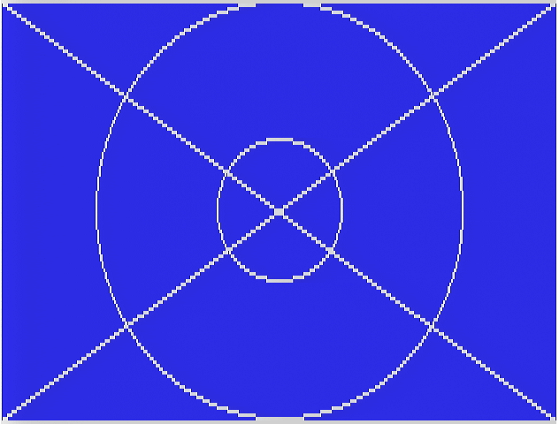
<br>
<em>Plot mode demo</em>
</p>

# Pixel Generator (ISR)

The **Pixel Generator** module belongs to the *Interrupt Layer* and is implemented almost entirely in Assembly. It is responsible for generating a signal suitable for driving the DACs.

It consists of three submodules:

- **TEXT Generator**
- **IMAGE Generator**
- **PLOT Generator**

Each one produces an appropriately formatted signal depending on the current state of the Video Terminal.


## Text Generator

In **Text Mode**, the module operates as follows:

- The Video Buffer is scanned from left to right.
- For each entry, the corresponding symbol is fetched from the **glyph table**.
- The symbol is loaded into the **PISO (SPI) register**, initiating serial transmission to the color multiplexer selector.
- The color information is read from memory and written to **LATD**, whose outputs feed the multiplexer inputs.
- This process repeats for every visible character on the screen.

Processing a single character — reading, preparing, and transmitting — takes **exactly 8 cycles**, which matches the precise time window required to load the SPI register and shift out all bits.

Assembly was mandatory because the equivalent C implementation consumed significantly more cycles, making the target resolution impossible to achieve.


### Color Bleeding Issue ...

The above procedure, however, conceals a fundamental problem that arose during signal generation. Because instructions are executed sequentially, the selection signal reached the multiplexers two cycles earlier than the color information. This caused **incorrect rendering**, visible as **color bleeding**.


<div align="center">
  <div style="border: 2px solid #000000; padding: 8px; display: inline-block;">
    
  </div>
  <br>
  <em>Color Bleeding effect</em>
</div>

<br>

This is one of the obvious reasons why such applications are typically implemented on FPGAs, where signals can be generated in parallel. Nevertheless, the solution proved to be simple.

Before the start of the process, the PISO (SPI) register is preloaded with data in such a way that an intentional two-cycle delay is introduced before the next load operation. 
In this way, both the selection signal and the color information arrive at the multiplexers simultaneously, and the above phenomenon is eliminated.        

<div align="center">
  <div style="border: 2px solid #000000; padding: 8px; display: inline-block;">
    
  </div>
  <br>
  <em>Free from Color Bleeding effect</em>
</div>

<br>
<br>

In the following snippet, INDF1 indexes into the video buffer while the TBLPTR registers address the glyph table. 
```
  MOVF POSTINC1,W,C   ; READ ASCII CHAR - 1 CY
  MOVWF TBLPTRL,C     ; 1 CY
  TBLRD*              ; READ ASCII GLYPH - 2 CYs
  MOVF TABLAT,W,C     ; 1 CY
  MOVWF INDF0,C       ; WRITE GLYPH DATA TO SPI - 1 CY
  MOVF POSTINC1,W,C   ; READ COLOR - 1 CY
  MOVWF LATD,C        ; WRITE COLOR DATA TO MULTIPLEXERS - 1 CY - TOTAL: 8 CYs
```
The sequence forms an 8-cycle pipeline in which a character code is fetched from the video buffer, its corresponding glyph byte is retrieved from program memory, 
and both the glyph and color data are output with cycle-perfect timing. First, the character is read and used to update the table pointer; 
the glyph byte is then fetched via TBLRD* and written directly to the SPI register through INDF0. Immediately afterward, the color attribute is read from the video buffer and 
written to LATD, which drives the external multiplexers. This tightly optimized 8-cycle routine is what makes it possible to display 360 logical pixels scaled across a 
640-pixel horizontal resolution.

## **Image Generator**

The graphics generation module follows a similar approach. The Video Buffer stores only the color information, while the remaining data are fetched directly from the microcontroller's flash memory. The procedure proved to be simpler compared to the text mode.

Its operating mechanism is as follows:  
The selected image is scanned from flash memory byte by byte. Each byte is loaded into the PISO register. The color corresponding to the specific 8x8 region is read from the Video Buffer and sent to the LATD port.  
This process provides a timing margin of two additional cycles, which indicates the possibility of increasing the color resolution in a future version. In the current implementation, for the sake of simplicity, two NOP instructions were inserted into the code in order to maintain the same number of cycles per generated element.
```
  TBLRD*+             ; READ IMAGE DATA AND POST INCREMENT - 2 CYs
  MOVF TABLAT, W,C    ; 1 CY
  MOVWF INDF0,C       ; WRITE IMAGE DATA TO SPI - 1 CY
  NOP                 ; 1 CY
  NOP                 ; 1 CY
  MOVF POSTINC1,W,C   ; READ COLOR - 1 CY
  MOVWF LATD,C        ; WRITE COLOR DATA TO MULTIPLEXERS - 1 CY - TOTAL: 8 CYs
```

## **Plot Generator**

The PLOT Generator module is responsible for producing a signal suitable for supporting the Plot mode.  
All available data reside in the Video Buffer, since the generated signal is now 1‑bit deep.

Its operating mechanism is as follows:  

It loads the multiplexers with the selected foreground and background colors, which are uniform across the entire screen.  
It scans the Video Buffer from left to right, byte by byte. It loads the contents of each location into the PISO register and activates the multiplexer selectors.

As in the previous module, the code provides a margin of four additional cycles, and for simplicity, NOP instructions were inserted.  
The limitation in the resolution of the Drawing mode is not due to the microcontroller’s clock speed, but to the limited memory capacity.  
Therefore, although it is possible to display additional data within the eight‑cycle time window, there is not enough memory to store them.

A snapshot of the Assembly code follows:
```
  MOVF POSTINC1,W,C   ; READ IMAGE DATA AND POST INCREMENT - 1 CY
  NOP                 ; 1 CY
  NOP                 ; 1 CY
  NOP                 ; 1 CY
  NOP                 ; 1 CY
  MOVWF INDF0,C       ; WRITE IMAGE DATA TO SPI - 1 CY
  MOVF INDF2,W,C      ; READ COLOR - 1 CY
  MOVWF LATD,C        ; WRITE COLOR DATA TO MULTIPLEXERS - 1 CY - TOTAL: 8 CYs
```

The insertion of NOP instructions may appear to be a waste of computational time; however, it simultaneously creates a “bubble” that is exploited by the DMA controller to transfer data to and from the UART bus.


## **Schematic Diagrams**

<p align="center">
  
</p>

<p align="center">
  
</p>

<p align="center">
  
</p>

<p align="center">
  
</p>


[](https://hackaday.io/project/205374-serial-vga-controller)  


